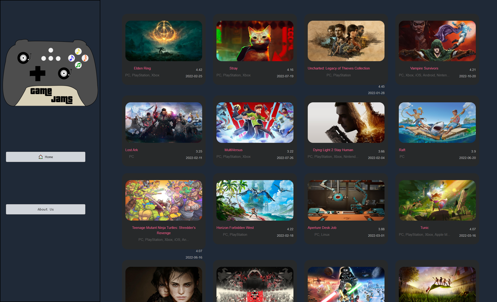

# GameJams

-  A website that goes through your steam library and recommends playlists and albums based on genre or motifs in game.

## Description

-  When playing games you often want to match the mood to the type of game you are playing on. With GameJams, that is now possible. Users will simply have to link their Spotify and Steam accounts and they can personalized recommendations of playlists for the games they play. 10 

-  albums and playlists will appear for each game using Spotify Api.

-  When building this project, our group learned how to use Tailwind, create a display module, and learn how to collaborate using GitHub.

## Features

-  Spotify API

-  Steam API

-  Generative playlists

-  Playing track samples on the second page

-  About use modal

Launched webstie link: https://bunggoylearn.github.io/GameJams/

